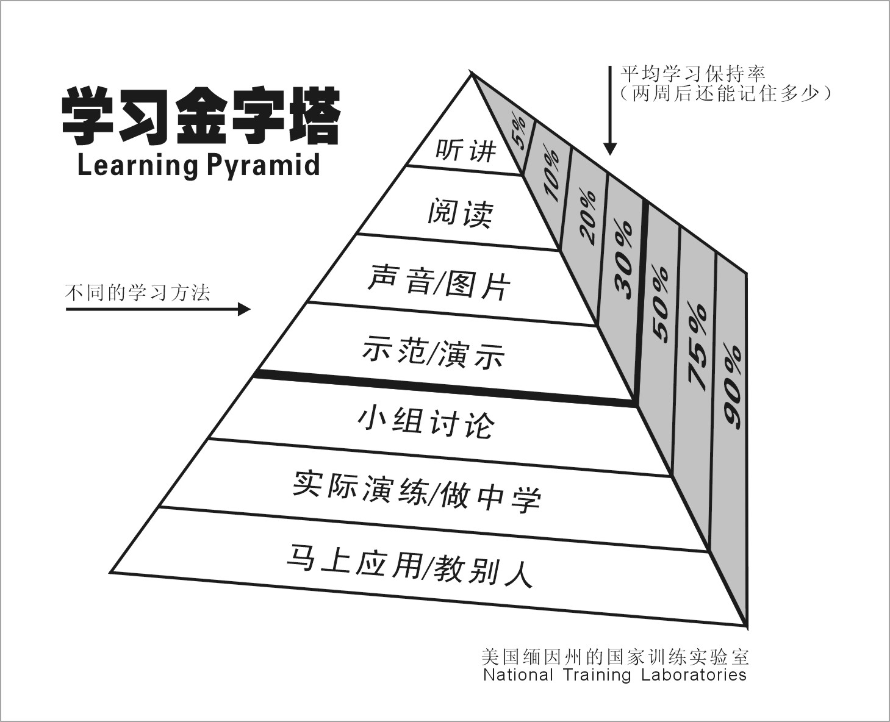

# 马可福音查经 课程介绍

用时：15分钟

## 课程的形式

通过和同学们交流查经课的授课形式，调整同学们对上查经课的认识。从老师讲同学听的模式，切换到老师带，同学练，一起查经的模式。

### 大家心目中的查经课是怎么的？

1. 老师查，同学听
2. 同学提问，老师回答
3. 老师示范，同学练习；老师提问，小组讨论；同学提问，相互回答

这次课程会采用第三种形式。通过这样的形式，相信可以帮助同学们更加有效的学习。

### 学习金字塔

请大家每次上课前都找好你的课程搭档。最少两个人，最多三个人。最好是同小组的。你们需要一起讨论问题，一起演故事，不懂的地方可以相互教导。还可以回到小组中，一起做组长的同工。

## 课程的目的

1. 分享一些对马可福音的观点和看法，可以帮助大家更好的了解这卷圣经
2. 介绍一些读圣经的通用方法，可以帮助大家可以主动的阅读圣经
3. 希望大家通过学习后都可以出去和更多的人分享，带领更多人来阅读圣经，传讲圣经

## 课程的内容

这次课程的内容分为两个部分：读故事和串故事。

### 读故事

​	我们的圣经和我们头脑中想象的经书还是有区别的。就拿我们要读马可福音来说。这卷书记载的是关于耶稣的事迹。也可以说是一部传记《耶稣传》。这里记载了一则一则的故事。所以我们要用读故事的方法来读这这卷书。

### 串故事

​	同时，这卷书和一般的传记还是有一些区别的。不单单记录一些有关耶稣的事件，就像流水帐一样。或者说作者没有记录耶稣的每一件事。大家要有这样的观点。作者有意识的选择记录了一些事件，那他挑选组织这些事件要表达什么意图，或者说他要传达什么思想呢？

​	这块内容可能是大家平时不熟悉的。如果把一个个的故事串联起来。从而发现作者要表达的意思。发现作者组织故事的意图，是读经中非常有意思的部分。