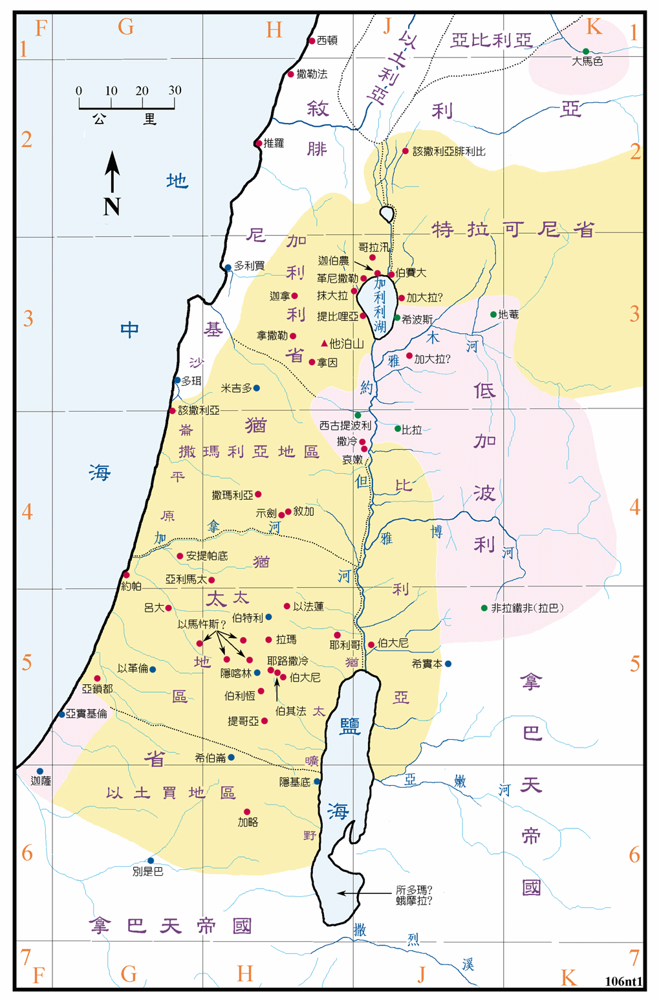
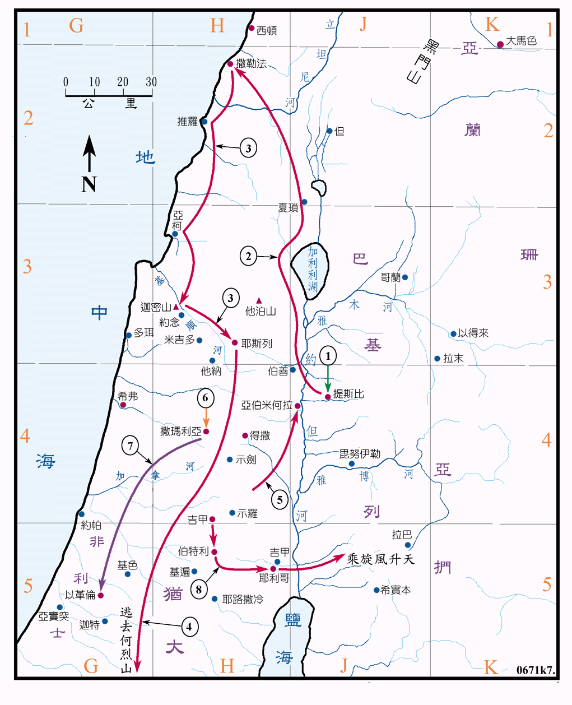
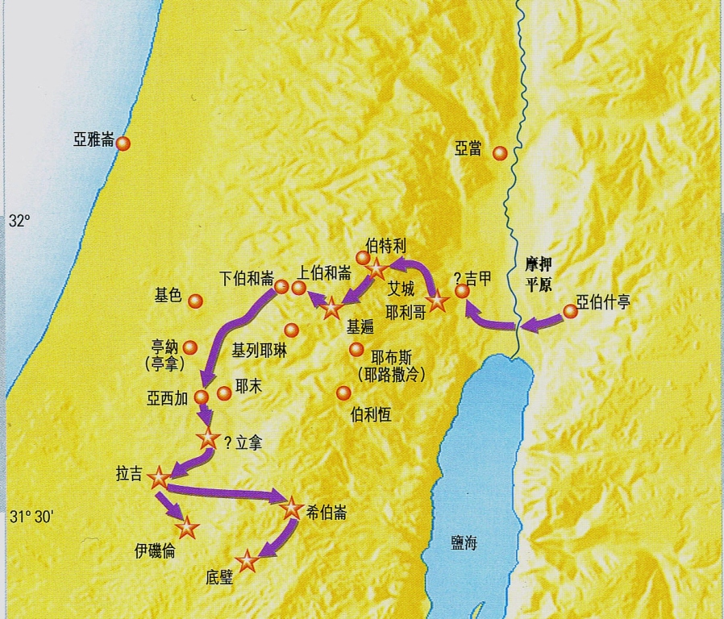

# 马可福音查经 第一课

用时：100分钟

## 如何读故事

​	阅读故事对于理解福音书非常的重要。这项技能也能为阅读圣经中其他叙述类书卷提供帮助。所以说阅读故事是阅读圣经的基础。同时阅读故事又是一件看起来非常简单的事，所以很容易被大家所忽视。导致一个结果就是故事好像是读懂了，但是不知道在讲什么；或者知道在讲什么，但是不知道为什么要这样讲。总结说就是，读懂了，但是不理解。或者干脆说读不懂。

​	接下来，向大家介绍一些套路。这些套路可以帮助大家开始【读懂】故事。

### 术语说明

​	接下来会出现一些词语，先向大家做一个集中介绍：

- 故事

  故事是指圣经中的讲述。可能是一段，也可能有多段。是很有弹性的词语。几个小故事拼凑成为一个大故事。

- 场景

  场景是指故事发生的背景。

- 片段

  片段是指大故事中的小故事

### 第一步 识别故事三要素

​	一般故事是由时间、地点、人物、事件几个要素组成的。在圣经书卷中前面三个要素相对容易识别，而事件要素比较难识别，因为有人物做的事、说的话。所以在这个课程中，我们把事件单独放在第二步中。我们先来看三要素：

#### 时间

​	时间要素在故事中有几种表现形式。这时间可以是具体的某天，比如除酵节的第一天（可14:12）；也可以是一个时期，比如尼布甲尼撒在位第二年（但2:1）；有的是一个绝对时间点，比如申初的时候（可15:34）；也有的是一个相对时间概念，比如过了六天（可9:2）。识别这些时间的类型对理解故事有非常大的帮助。

| 时间类型 | 应用方向           |
| ---- | -------------- |
| 具体某天 | 特殊的日子，特殊的含义，节期 |
| 一个时期 | 时代背景，相关历史事件    |
| 绝对时间 | 对作者的意义非常大      |
| 相对时间 | 联系上下文          |

​	这个划分方式，以及应用方向只是给大家一个参考。大家读了一段时间后，可以有自己的划分方式。而且有的时间容易识别；有的时间需要联系上下文；还有的是没有时间。在这里把时间作为故事要素来讲，是提醒大家在读故事的时候，首先就是要找故事的时间，并且揣摩这个时间对发生的这个故事有什么意义。

#### 地点

​	地点要素在故事中也有几种表现形式。有的是具体的一个地方，比如进了西门和安德烈的家（可1:29）；有的则是一个区域，比如从犹太、耶路撒冷、以土买、约旦河外并推罗、西顿（可3:8）；有的地点是泛指，比如高山、海边；有的则是明确说是会堂、圣殿；还有的是指一段旅程，比如他们行路上耶路撒冷去（可10:32）。相对时间要素，地点要素更加容易发现。但是不能因为一目了然，就忽略了这个要素。特别是作者明确说是什么地点的时候，我们就要留意揣摩这个地方对发生的这个故事有什么意义。

​	但也不要过度理解。

#### 人物

​	我们在读故事的时候，大部分是在读关于人物做的事或者人物说的话。所以人物是故事中最主要的要素。在识别三要素的部分，我们先把故事中有哪些任务识别出来。人物说的话和做的事，放在剧情解析部分做详细分析。

​	识别故事中有哪些人物相对简单，但是考验大家的是故事中的一些隐藏人物。这些人物需要大家用想象力来还原现场，从而发现这些隐藏人物。有的时候隐藏人物对剧情没有什么太多影响，但是有的时候隐藏人物却对剧情有非常大的影响。具体的例子，在我们随后的读经过程中，会一一解释。

#### 小结

​	时间和地点构成了故事的背景。作者用时间和地点构建起了一个历史舞台。每个人物所做的事，所说的话，所做的每个决定，或者是对事件的反应，都是在这个背景下发生的。

### 第二步 剧情分析

​	在识别三要素后，我们就可以开始分析剧情。分析剧情是读故事的时候最有意思的部分了。要提醒大家的是，在分析剧情的时候，不要忘记三要素。也就是说要带着三要素来分析剧情。分析剧情最好是一边阅读一边运用想象力构建起一副场景。自己就像是身临其境，处在故事发生的现场。观察着这些人物。体会着他们的各种情绪。我们就会有多一些的机会了解他们为什么说这话，他们为什么做这事。

​	下面我们结合一段经文来看在剧情分析时，可以有哪些思考方向。同时也会把**识别故事三要素**的内容练习一遍。请一位同学读马可福音1章4-8节。

#### 三要素

##### 时间

1. 这段故事发生在什么时候？它的时间要素是什么？
   - 没有答案的时候，可以将问题细分一下。比如，这个时间是具体某天还是一个时期？是绝对时间还是相对时间？用这样的方法可以把【未知】缩小到一个范围内
   - `照这话，约翰来了`这句有可能是表示时间，应该是一个相对时间，同时表示一个时期
2. 这个时间对发生的这个故事有什么意义？
   - 相对时间的观念引导我们去看上文，看看这段描写是接在什么后面？
   - 引用的经文是什么时代的？
   - 请大家发挥想象力，从这个时间可以联想到什么？
   - 大家所想的，有的是，有的不是那么是，没关系都留着，接着读下去，慢慢的那个所是的就会出来的

##### 地点

1. 这段故事发生在什么地方？
   - 这是一个具体地点，还是指一个地区呢？

   - 是什么地方的旷野？请大家可以通过地图猜一猜

     A 约旦河上游，加利利湖以北

     B 约旦河上游，加利利湖以南

     C 约旦河中游

     D 约旦河下游，死海以北

     
2. 这个地方对发生的这个故事有什么意义？
   - 这个地方曾经发生过什么事件？

     A 请猜一猜这个图讲的是哪位先知的事迹

     

     B 请猜一猜这个图讲的是哪个历史事件

     

     可以思想这个地方发生的历史事件，是不是作者想要读者产生联系的。

   - 为什么是旷野？旷野相对的是什么？

     A 旷野这个地方也非常有意思，传道最好的地方，当然是人多的地方，这个地方人很多？

     B 约翰不是按人多少来选择的，而是按照先知书的指示，要他去旷野

     C 约翰和耶路撒冷的法利赛人分别开来

##### 人物

看完时间地点，我们来看人物要素，请大家列出这段故事中的人物。

1. 先把看的见的人物列出来：

   | 约翰   | 犹太全地和耶路撒冷的人 |
   | ---- | ----------- |
   | 个人   | 群体          |

2. 这些人物对发生的这个故事有什么意义？

   - 约翰的身份
   - 群体的特征

3. 猜一猜有隐藏人物吗？

   - 西门和安德烈
   - 撒迦利亚和伊丽莎白

   这个部分可以帮助大家把圣经串起来。有点难度的，猜不出就算了。


#### 场景构建

​	现在你对故事发生的时间，地点以及人物有了比较多了解。就可以利用这些素材构建出故事发生的场景。同时结合人物的行动和对话描写，在你面前就会展现出一幅幅生动的画面。鼓励大家读经要有场景感。

​	用自己的话描述马可福音1章4-8节。

#### 观察思考 

​	场景帮助你把故事印在脑海中。你就可以反复的看，反复的想。有可能你会问，都看完了，我应该想什么呢？好像没有什么好想的。其实前面的都是准备工作，阅读故事才刚刚开始。接下来我们就要仔细观察。请注意，看和观察是不一样的。观察是带着探索期望发现的心来看的。还是以马可福音1章4-8节做例子，我们应该怎么样来观察思考。

1. 请注意观察犹太全地和耶路撒冷的人来到约翰面前时的表情、神态
2. 从犹太全地和耶路撒冷这些人行为，是否可以看出他们心里在想什么
3. 约翰在看见这些人时，是什么表情？什么态度？
4. 约翰在说话的时候，用的是怎么样的语气

#### 小结

​	大家在分析剧情观察思考的时候，要发挥自己的想象力。这想象力不是说天马行空的乱飞。而是在经文的基础上展开的思考，是用理智、知识的推理。

### 第三步 总结提炼

#### 提问

​	前面在剧情分析部分，我们也提了很多问题。那些问题基本是针对细节的、局部的。现在我们要提“大”一些的问题了。这问题可以帮助我们提升眼界，在一个高度上看这个故事。

```
	这段经文说了些什么？
```

​	回答这个问题的时候要小心，一不留心就容易把我们导向自我，讲自己的看法，而不是经文的内容。就像一千个观众有一千个哈姆雷特。我们要练习发现经文本来的意义，或者说是经文的客观意义。	

```
	我认为作者的意思是要..........
```

​	回答这个问题时，让我们开始进入作者视角，去观察提炼作者的意思。

#### 总结

​	总结是用比较多的字概括故事的意思。请同学们做总结马可福音1章4-8节。注意不要复述故事。

#### 提炼

​	提炼是用比较少的字表达故事的意思，就是把上面总结的文字一遍一遍的精简。这个过程会把作者要表达的意思突显出来。请同学们提炼自己写的总结。

​	下面是我的一些提炼，大家可以把这些提炼放在一起，品一品，挑一个作为故事的标题。定标题的时候也不要太纠结，后面是可以修改的。

- 约翰来了
- 众人的悔改
- 约翰的见证

## A 练习读故事

​	帮助同学们加深对三要素、故事分析、总结提炼这三个读故事步骤的印象。并且开始实践，把这三个步骤运用到读经过程中。

​	从马可福音1章16节到39节，作者记录了四个故事。我们给这些故事编号为一号到四号。为什么用编号呢？因为我知道在这课结束后，你们可以用自己的语言给这四个故事写上标题，而且会写的更好。

### 到了迦百农

​	我们先从这第二个故事开始练习。这个故事可以慢一些，帮助同学们熟悉读故事的步骤。

#### 一 识别三要素

| 要素   | 问题                 | 回答   |
| ---- | ------------------ | ---- |
| 时间   | 这段故事发生在什么时候？       |      |
| 时间   | 这个时间对发生的这个故事有什么意义？ |      |
| 地点   | 这段故事发生在什么地方？       |      |
| 地点   | 这个地方对发生的这个故事有什么意义？ |      |
| 人物   | 这段故事中有哪些人物？        |      |
| 人物   | 有隐藏人物吗？            |      |
| 人物   | 这些人物对发生的这个故事有什么意义？ |      |

​	大家可以用这些常规问题问问自己，让这些问题带着自己开始观察探索这段故事。在小组练习中，可以两三人一组，相互提问，轮流回答，这样的方式会更加好。

#### 二 剧情分析

​	两人一组，轮流构建场景。根据场景一起列出可以观察探索的方向。有发现的内容就写上，没有发现的内容就作为问题留着。

| 观察方向            | 发现的内容                             |
| --------------- | --------------------------------- |
| 耶稣的教训和文士不一样     | 有权柄；众人好像都能认出权柄；没权柄的文士教导他们也听了这么长时间 |
| 被污鬼附的人什么时候在会堂的？ |                                   |
| 这污鬼什么时候叫起来的？    |                                   |
| 为啥要记录污鬼的话？      |                                   |
|                 |                                   |
|                 |                                   |
|                 |                                   |
|                 |                                   |
|                 |                                   |

#### 三 总结提炼

1. 这段故事说了些什么？
2. 我认为作者的意思是要..........
3. 给故事写一个标题

### 他们一出会堂

​	通过前面这个读故事的训练，大家对读故事方法，是不是有点掌握了。接着读第三个故事，巩固读故事的方法。

#### 一 识别三要素

​	不分组讨论，直接由老师提问，轮流请同学回答。

1. 这段故事发生在什么时候？
2. 是绝对时间还相对时间？（相对时间就像是连接件，把两个故事连在了一起）
3. 这段故事发生在什么地方？
4. 人物有哪些？（提示同学还有西门，安德烈，雅各，约翰）

#### 二 剧情分析

​	由老师构建故事场景，然后请同学们观察并回答问题。

1. 西门邀请耶稣去自己家还是耶稣要求去西门家？
2. 耶稣在服事的时候，西门在干什么？
3. 被赶出的鬼打算说什么？

#### 三 总结提炼

1. 这段经文说了些什么？请两位同学总结。
2. 我认为作者的意思是要.....
   - 耶稣会治病
   - 岳母会感恩
   - 很多人生病
   - 鬼认识耶稣
   - 以上都不是

当不是很容易把握故事要表达的意思时，可以把问题暂时放一放。我们先暂时不给这段故事写标题，继续读第四个故事。

### 次日早晨

时间：次日早晨 （相对时间，连接上文）

地点：旷野

人物：耶稣、西门、同伴

#### 对话分析

在这段故事中，对话占了很大的篇幅。第一课介绍过，当出现对话的时候，可以揣摩说话人的语气。还可以联系上下文揣摩说话人的心里活动。

1. 请大家模拟一下西门说话的语气是怎么样的？
2. 当时西门心里是怎么想的？
3. 他有想过耶稣是干什么的吗？

再来看耶稣的回答

1. 耶稣说话的语气是怎么样的？
2. 耶稣知道西门怎么想的吗？
3. 耶稣要表达的中心是什么？

#### 总结提炼

通过对话的分析，大家觉得这个故事是在说什么？

- 旷野的祷告
- 心系加利利
- 耶稣的使命

## B 尝试串故事

​	在课程介绍中，我们提到过福音书和一般的传记还是有一些区别的。福音书不像流水帐记录一些有关耶稣的事件。作者是有意识的挑选记录了一些事件，然后按照他要表达的主题来组织这些故事。对于读一个一个的故事，大家还是比较熟悉的。要把这些故事按照作者的意图串起来，可能大家不是很熟悉。这节课我们先做一个尝试。把2，3，4这三个故事串一串。看看作者用这三个故事向我们传达什么信息。

### 方法

​	串故事最直接的方法，就是把这几个故事的标题列出来，然后找一条线索或者主题，把这几个标题连起来。当发现连不来的时候，就回去把其中几个故事的标题换一个，然后在尝试连起来。例如：2,3,4故事

| 编号   | 故事二     | 故事三     | 故事四        |
| ---- | ------- | ------- | ---------- |
| 1    | 会堂赶鬼    | 医治岳母    | 旷野祷告       |
| 2    | 会堂赶鬼    | 城里赶鬼    | 加利利赶鬼      |
| 3    | 耶稣的权柄   | 医病赶鬼    | 耶稣的心声      |
| 4    |         |         |            |
| 5    | 赶鬼      | 医病      | 传道         |
| 6    | 赶鬼吗？不是的 | 医病吗？不是的 | 传道，我是为这事来的 |
| 7    | 赶鬼？     | 医病？     | 传道！        |

### 总结

读故事是串故事的基础，串故事是读故事的目标。读了差不多了就尝试串一串，发现串不起来就回过来再读一读。

## 课后作业

1. 为这四段故事，每个都写一个标题；每个标题的字数控制在7个字以内。
2. 思想第一个故事和其他三个故事的关系，尝试找出一条主线，把这四个故事串联起来。

## 读经小贴士

​	尽管我们前面一直在讲各种方法。大家一定要知道方法是帮助你开始读圣经。一旦你开始读圣经了，就要留心听圣灵的声音。当你在做要素分析，或者剧情分析，或者总结提炼的时候，圣灵会是你最好的帮助者。有了圣灵的帮助，读经不是枯燥的文法分析，而是不失理智的情感交流。你可以和约翰面对面，和马可面对面，还可以和耶稣面对面。

## 参考经文

1. 使徒行传19章4节
2. 约翰福音1章28、35节
3. 列王记下2章1-10节
4. 约书亚记3章19节
5. 玛拉基书3章1节
6. 以赛亚书40章3节

