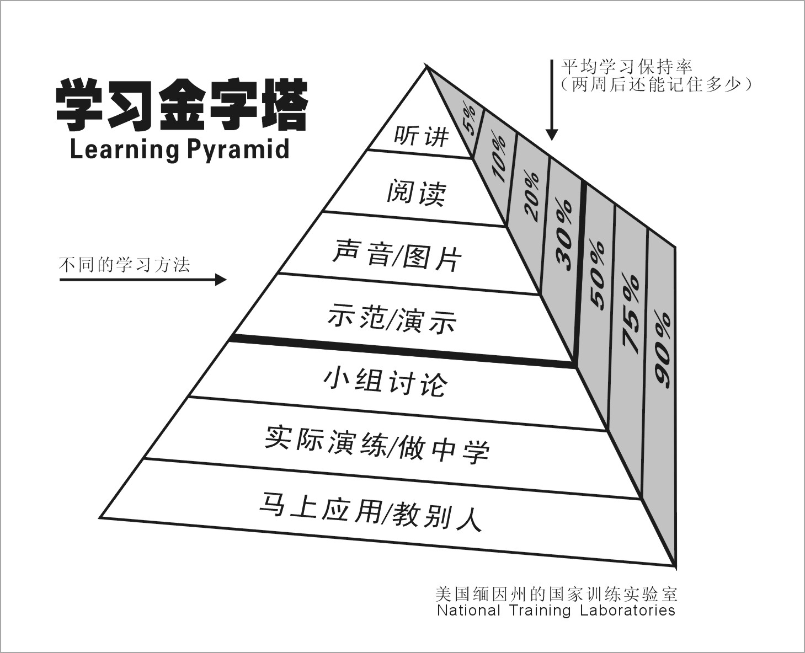

# 马太福音查经 课程介绍

用时：15分钟

## 课程的形式

通过和同学们交流查经课的授课形式，调整同学们对上查经课的认识。从老师讲同学听的模式，切换到老师带，同学练，一起查经的模式。

### 大家心目中的查经课是怎么的？

1. 老师查，同学听
2. 同学提问，老师回答
3. 老师示范，同学练习；老师提问，小组讨论；同学提问，相互回答

这次课程会采用第三种形式。通过这样的形式，相信可以帮助同学们更加有效的学习。

### 学习金字塔

请大家每次上课前都找好你的课程搭档。最少两个人，最多三个人。最好是同小组的。你们需要一起讨论问题，一起演故事，不懂的地方可以相互教导。还可以回到小组中，一起做组长的同工。

## 课程的目的

1. 介绍一些读圣经的通用方法，可以帮助大家阅读圣经更加有动力，有兴趣，有热情
2. 希望大家通过学习后都可以出去和更多的人分享，带领更多人来阅读圣经

## 课程的内容

这次课程的内容分为两个部分：观察和反思。

### 观察

​	帮助大家知道观察什么？如何观察？我就像是一个导游，游览马太福音。

​	导游可以帮助你解决一下问题：

1. 不知道怎么看（欣赏）
2. 不知道哪里有风景
3. 不知道重要性

​	但是导游有导游的问题：

1. 不能代替你的眼
2. 不能代替你的心
3. 最多算个介绍人，需要你自己建立和圣经的关系

### 反思

​	所以，除了观察外，还需要大家常常思想。【昼夜思想，这人便为有福】。这句话是很有道理的，当我们开始常常默想圣经中的场景，话语，教导的时候，就会越来越了解神的心意。

​	反思和观察是我们读圣经中密不可分的两个工具。掌握了这两个工具，大家一定会爱读圣经的。

## 观察的作用

​	观察对于理解福音书非常的重要。这项技能也能为阅读圣经中其他叙述类书卷提供帮助。可以说观察是阅读圣经的基础。当我们学会了这么观察，那阅读圣经就相对会有很多的看见了。

​	同时观察也是为反思积累素材。反思是建立在观察的基础上的。观察就是仔细的看，那怎么看呢？接下来，向大家介绍一些套路。这些套路可以帮助大家开始【读懂】圣经故事。

## 叙事单元

​	观察要细，反思要宽。观察就是仔细的看。既然是仔细的看，那就要适当细一些。一般来说圣经中的1章对我们观察来说有点大了，大家可以尝试把1章分为几个单元来观察。要注意一开始读的时候可以不要太细。你切分好的这些观察单元，我们称为叙事单元。

​	大家要有这样的观点。这些叙事单元彼此之间是有联系的。

## 故事要素

​	一般故事包含时间、地点、人物、个要素组成的。这是我们要观察的内容：

#### 时间

​	时间要素在故事中有几种表现形式。这时间可以是具体的某天，比如除酵节的第一天（可14:12）；也可以是一个时期，比如尼布甲尼撒在位第二年（但2:1）；有的是一个绝对时间点，比如申初的时候（可15:34）；也有的是一个相对时间概念，比如过了六天（可9:2）。识别这些时间的类型对理解故事有非常大的帮助。

| 时间类型 | 反思方向           |
| ---- | -------------- |
| 具体某天 | 特殊的日子，特殊的含义，节期 |
| 一个时期 | 时代背景，相关历史事件    |
| 绝对时间 | 对作者的意义非常大      |
| 相对时间 | 联系上下文          |

​	这个划分方式，以及应用方向只是给大家一个参考。大家读了一段时间后，可以有自己的划分方式。而且有的时间容易识别；有的时间需要联系上下文；还有的是没有时间。在这里把时间作为故事要素来讲，是提醒大家在读故事的时候，首先就是要找故事的时间，并且揣摩这个时间对发生的这个故事有什么意义。

#### 地点

​	地点要素在故事中也有几种表现形式。有的是具体的一个地方，比如进了西门和安德烈的家（可1:29）；有的则是一个区域，比如从犹太、耶路撒冷、以土买、约旦河外并推罗、西顿（可3:8）；有的地点是泛指，比如高山、海边；有的则是明确说是会堂、圣殿；还有的是指一段旅程，比如他们行路上耶路撒冷去（可10:32）。相对时间要素，地点要素更加容易发现。但是不能因为一目了然，就忽略了这个要素。特别是作者明确说是什么地点的时候，我们就要留意揣摩这个地方对发生的这个故事有什么意义。

​	但也不要过度理解。

#### 人物

​	我们在读故事的时候，大部分是在读关于人物做的事或者人物说的话。所以人物是故事中最主要的要素。在识别三要素的部分，我们先把故事中有哪些人物识别出来。

​	识别故事中有哪些人物相对简单，但是考验大家的是故事中的一些隐藏人物。这些人物需要大家用想象力来还原现场，从而发现这些隐藏人物。有的时候隐藏人物对剧情没有什么太多影响，但是有的时候隐藏人物却对剧情有非常大的影响。具体的例子，在我们随后的读经过程中，会一一解释。

​	接着就可以观察人物的说话和行动。从人物的说话和行动中我们就看出这个人物的性情、品格。后面我们会结合马太福音通过一些练习帮助大家熟练使用这些方法。

